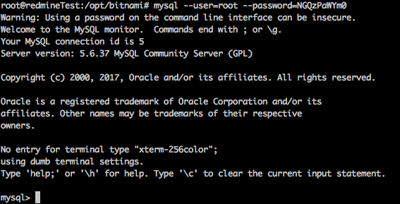

Прежде всего запустите mysql:

```sql
mysql --user=root --password=your_password
```

Вы можете найти ваши параметры подключения в **{your redmine folder}/htdocs/config/database**

Если учетные данные правильные, вы увидите приветственное сообщение от консоли MySql:  


Теперь вам нужно показать все базы данных на текущем mysql сервере, выполните эту команду:

```sql
SHOW DATABASES;
```

Вы увидите что-то вроде этого:

Нам нужно выбрать активную базу данных, выберите что-то со словом "redmine" в названии, для меня это "bitnami\_redmine" и выполните команду:

```sql
use your_database_name;
```

В моем случае это выглядело так:

Чтобы показать информацию о текущих пользователях, вы можете использовать эту команду:

```sql
select * from users;
```

Затем мы можем сбросить пароль и любое другое свойство для любого пользователя в этой таблице. Пример с пользователем admin:

```sql
update users set hashed_password = '353e8061f2befecb6818ba0c034c632fb0bcae1b', salt ='' where login = 'admin';
```

Или вы можете сбросить пароль для обычного пользователя и дать ему права администратора одновременно:

```sql
update users set hashed_password = '353e8061f2befecb6818ba0c034c632fb0bcae1b', salt ='', admin = 1 where login = 'user';
```

Теперь мы можем войти в redmine с правами администратора, используя пароль: **password  
**для аккаунта, который вы использовали на предыдущем шаге.
