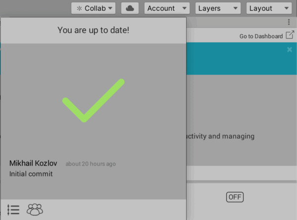

В Unity вы можете создать команду и работать вместе над одним проектом.

Просто перейдите на [страницу Unity Organizations](https://id.unity.com/en/organizations/) и создайте новую команду.

Затем вы можете создать новый проект или открыть существующий.

Перейдите в Window > General > Services.

В правом верхнем углу нажмите "Сollab" и сделайте свой первый коммит.

Теперь вы можете перейти на страницу проектов и найти свой проект.

Выберите свой проект, и появится дополнительная информация.

Отлично! Удачи с вашим новым проектом, увидимся скоро 😉
