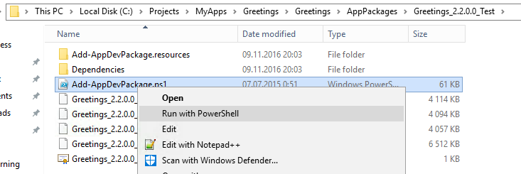

Я разрабатываю универсальные Windows программы и нашел интересную проблему. Вы не можете использовать UI версию Windows App Certification Kit, когда ваша ОС - Windows Server 2016.

Когда я попытался протестировать свою программу перед отправкой в Windows Store, я получил ошибку от Windows App Certification Kit:


Но мы все еще можем использовать консольное приложение – **appcert.exe**

Это немного сложнее, чем использовать UI версию, нам нужно создать некоторые приготовления:

1\. Вам нужно установить подготовленную версию вашего приложения, это рядом с файлом bundle. Найдите файл под названием Add-AppDevPackage.ps и запустите его с PowerShell.



2\. Откройте PowerShell и выполните команду:

```powershell
Get-AppxPackage > packages.txt
```

3\. Откройте файл packages.txt и найдите ваше приложение, скопируйте PackageFullName:


4\. Создайте файл **testPackage.bat** и поместите этот текст внутрь:

```batch
del %~dp0\report.xml
"C:\Program Files (x86)\Windows Kits\10\App Certification Kit\appcert.exe" reset
"C:\Program Files (x86)\Windows Kits\10\App Certification Kit\appcert.exe" test -apptype windowsstoreapp -packagefullname "Your app package full name" -reportoutputpath %~dp0\report.xml
pause
```

5\. Не забудьте заменить текст "Your app package full name" на текст из 3-го шага. Теперь вы можете запустить файл **testPackage.bat**, и когда он будет готов, проверьте файл **report.xml**. Там вы найдете всю информацию от Windows App Certification Kit о вашем приложении.
