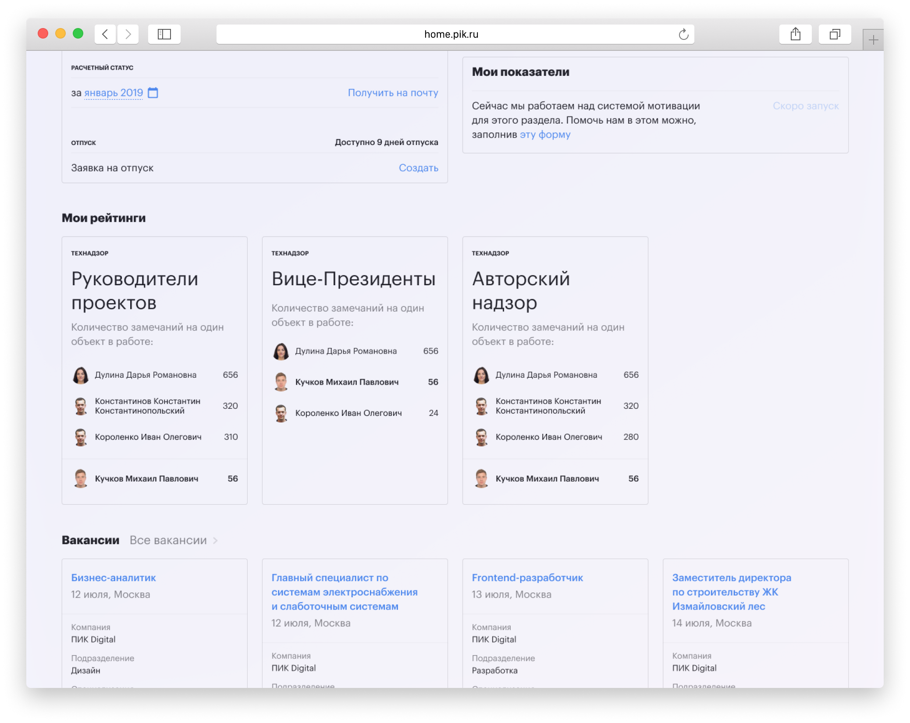
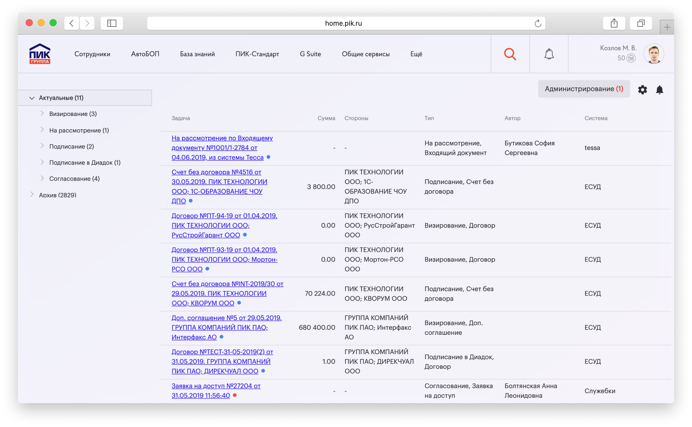
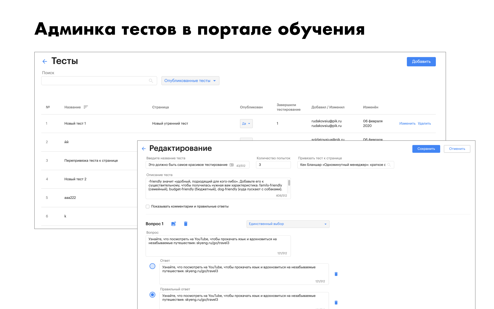

Это крупномасштабный проект корпоративного портала для Группы ПИК, одной из крупнейших строительных компаний России. Портал обслуживает тысячи сотрудников и подрядчиков, предоставляя доступ к различным бизнес-процессам и инструментам.

## Обзор проекта

Корпоративный портал построен на современных веб-технологиях и предоставляет:

- **Управление пользователями**: Централизованная аутентификация и авторизация
- **Управление документами**: Загрузка, хранение и контроль версий
- **Бизнес-процессы**: Автоматизация рабочих процессов и процессы согласования
- **Отчетность**: Инструменты аналитики и бизнес-аналитики
- **Интеграция**: Подключение к различным корпоративным системам

## Техническая архитектура

Портал построен с использованием:

- **Frontend**: React.js с TypeScript
- **Backend**: .NET Core с C#
- **База данных**: SQL Server
- **Аутентификация**: Интеграция с Active Directory
- **Развертывание**: Docker-контейнеры на Azure

## Ключевые возможности

### Пользовательский интерфейс
Портал имеет современный адаптивный дизайн, который работает на всех устройствах.

### Панель управления
Главная панель предоставляет быстрый доступ к ключевым метрикам и последним действиям.

### Навигация
Интуитивная система навигации с хлебными крошками и функцией поиска.

### Управление пользователями
Комплексный интерфейс управления пользователями с контролем доступа на основе ролей.

### Управление документами
Продвинутое управление документами с контролем версий и рабочими процессами согласования.

### Бизнес-процессы
Автоматизация рабочих процессов для различных бизнес-процессов, включая согласования и уведомления.

### Отчетность
Комплексная панель отчетности и аналитики.

### Мобильная адаптивность
Портал полностью адаптивен и работает безупречно на мобильных устройствах.

### Интеграция
Безупречная интеграция с существующими корпоративными системами.

### Производительность
Оптимизирован для высокой производительности с тысячами одновременных пользователей.

### Безопасность
Корпоративная безопасность с многофакторной аутентификацией и аудитом.

### Развертывание
Автоматизированный pipeline развертывания с непрерывной интеграцией и доставкой.

### Мониторинг
Система мониторинга и оповещений в реальном времени.

### Документация
Комплексная документация и руководства пользователей.

Задача заключалась в создании ресурса, из которого можно было бы получить доступ к основным системам компании, найти нужного коллегу, увидеть кто чем занимается, согласовать документы, читать документацию, публиковать и читать последние новости.

Основные цели:

*   Единая экосистема для всех сервисов.
*   Сокращение временных затрат в рутинных бизнес-процессах.
*   Геймификация в работе и обучении.
*   Вовлечение персонала в жизнь и развитие компании.
*   Предоставление информации из всех сервисов компании в одном месте.

Главная страница корпоративного портала Группы ПИК

Сквозной поиск по разным системам.

Новости отправляются самими сотрудниками или добавляются специалистом по внутренним коммуникациям.

Виджеты показывают базовую информацию, которая может пригодиться каждый день:  
– дни рождения и отпуска;  
– созданные заявки и их статус;  
– задачи согласования, назначенные сотруднику.

Мы отображаем информацию из самых важных систем компании, чтобы можно было сразу понять статус, не заходя в систему.

Баннер может создать сотрудник HR-отдела через панель настроек.

Предложения по баннерам делают обычные сотрудники.

Самые важные новости в виде баннеров. Там мы просим обратную связь по какому-то сервису, помогаем решить проблему, принимаем решение для всей компании или просто информируем о чем-то очень важном.

Сотрудники всегда могут отказаться от показа баннера или закрыть его и ответить позже.

У каждого сотрудника есть свой личный кабинет. Там можно увидеть информацию о себе и своих должностях. Личную информацию заполняет сам сотрудник. Сотрудник может указать лучший способ связаться с ним и чем он занимается. Также можно указать, что вы на больничном или работаете из дома.

Информация об отпуске подтягивается автоматически из системы ZUP 1C. Здесь можно увидеть остаток отпуска, заказать основные виды справок, расчетный лист или перейти к сервисам, связанным с обучением.

Информация о позиции в рейтинге подтягивается автоматически из систем, которые собирают статистику по KPI. Уже сейчас можно увидеть рейтинги, в которых участвует сотрудник, и какое место он занимает.

Также отображаем последние вакансии, которые могут заинтересовать сотрудника или его знакомых.

В левой части страницы отображается информация о подразделениях и других сотрудниках в выбранном подразделении.

Это публичная страница сотрудника, которую могут видеть коллеги. Информация собирается из кадровых и отчетных систем, личные данные заполняются самими сотрудниками.

В правой части страницы показываем подробную информацию о выбранном сотруднике:  
– проекты, в которых участвует сотрудник;  
– день рождения и стаж работы в компании;  
– значки за достижения;  
– контакты, включая информацию о рабочем месте. При клике показываем позицию сотрудника на карте;  
– дополнительная информация отображает данные, заполненные самим сотрудником.

Данные и расчеты консолидируются и автоматически подтягиваются из внешних источников.

Из личного кабинета или из шапки портала можно перейти в раздел рейтингов. Где сотрудники могут увидеть, какое место они занимают и какие показатели у их коллег.

Лидеры рейтинга получают значки, которые видны другим сотрудникам в разделе контактов.

Пример формы для создания заявки на подбор сотрудника.  
Вы указываете всю необходимую информацию для HR, заявка отправляется руководителю кабинета согласования на портале, и если она успешно согласована, информация о нужной вакансии идет напрямую в систему рекрутинга – huntflow.

Задачи приходят автоматически после того, как они появляются в исходных системах.

Задачи из основных систем компании собираются в кабинете согласования. Это могут быть договоры, счета на оплату, заявки на отпуск, увольнение сотрудника или согласование бюджета.

Это экономит деньги на печати документов, согласования проходят быстрее и людям не нужно открывать разные системы для согласования счета или отпуска, все доступно в одном окне.

Для удобства мы сделали мобильные приложения для iOS и Android, где можно настроить всплывающие уведомления при получении новой задачи. Также на email отправляется сообщение с краткой информацией по задаче.

Карточка заполняется отделом кадров.

На карте показываем всех сотрудников, можно перейти к карточке сотрудника, чтобы узнать контакты.

Сотрудники из того же подразделения, что и выбранный человек, выделяются красной рамкой.

Можно увидеть позицию ключевых офисных локаций и названия переговорных комнат.

Вакансии попадают на портал из системы рекрутинга автоматически.

Каждый сотрудник может откликнуться на внутреннюю вакансию или порекомендовать знакомого.

Были случаи повышения, когда сотрудник проявлял инициативу, откликался на более высокую должность и после собеседования получал новую позицию.

