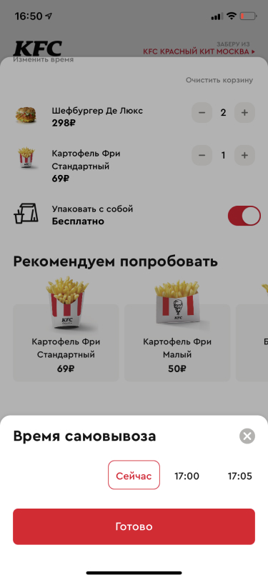
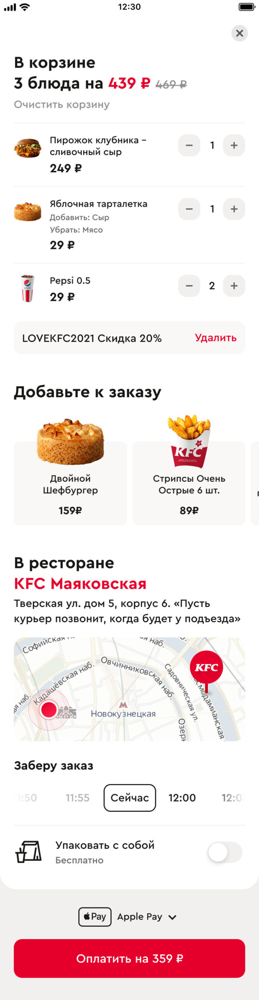

Мобильное приложение для сети ресторанов KFC. Приложение позволяет клиентам заказывать еду, отслеживать доставку и управлять своей программой лояльности.

## Ключевые возможности

### Процесс оформления заказа
Приложение имеет улучшенный процесс оформления заказа с лучшим пользовательским опытом.

### Способы оплаты
Множественные варианты оплаты, включая карты и цифровые кошельки.

### Отслеживание заказа
Отслеживание заказа в реальном времени с обновлениями статуса доставки.

### Результаты
Новый дизайн приложения привел к значительным улучшениям в вовлеченности пользователей и конверсии.

### Аналитика
Улучшения конверсии и аналитика поведения пользователей.

