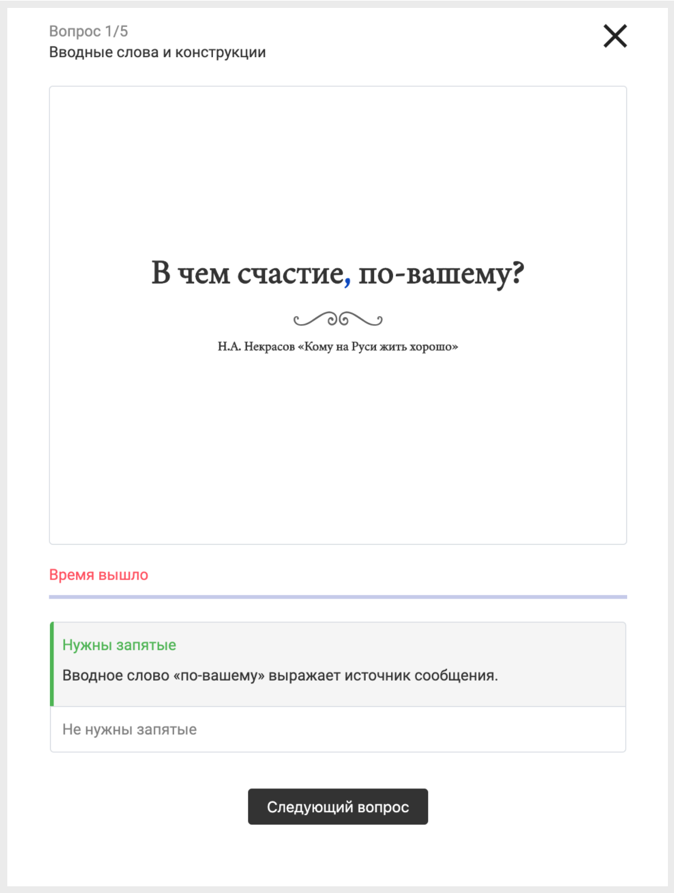
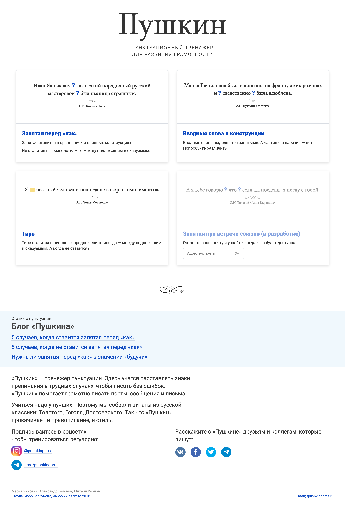

Страница игры
-------------

С помощью симулятора pushkingame вы можете научиться делать меньше ошибок при письме на русском языке. Нужно выбрать правильный ответ, и вы увидите верный вариант и соответствующее правило русского языка.

[Играть в PushkinGame](https://mixvlad.github.io/PushkinGame/ "Играть в PushkinGame")

Страница результатов
-------------------

После 5 ответов вы увидите свой результат и поймёте, насколько вы близки к великому русскому поэту Александру Пушкину.

Главная страница
----------------

В игре есть три режима — запятые, запятые с таймером и тире.

Технологии
----------

Для разработки сайта pushkingame я использовал Angular. [Исходный код доступен на GitHub](https://github.com/mixvlad/PushkinGame). Проект размещён на Github Pages.

