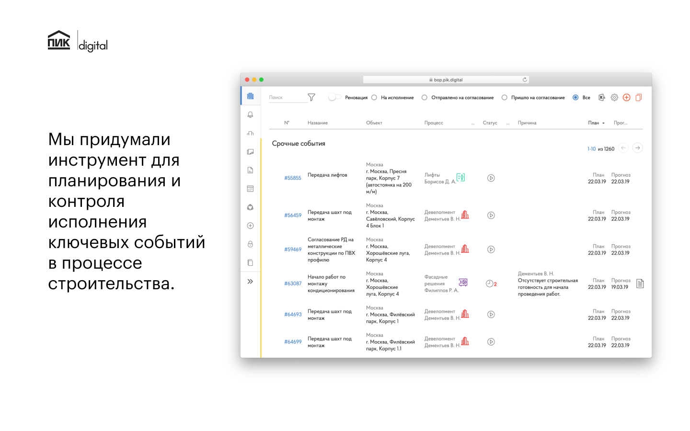
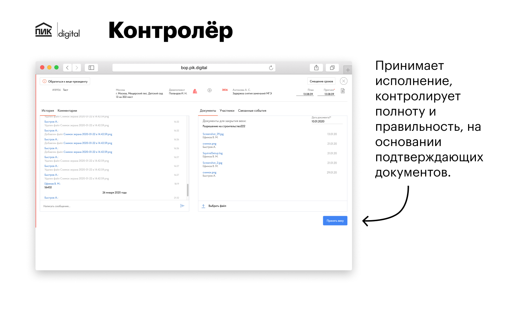
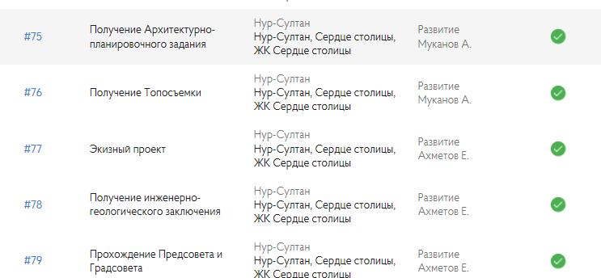

Комплексная SaaS-платформа для управления проектами и процессами разработки в Группе ПИК.

## Компоненты системы

### Дизайн-система
Дизайн-система и библиотека компонентов для SaaS-платформы.

AutoBOP — это система для планирования и контроля графиков строительства. Мы создали приложение, которое решает задачи девелоперов.  
[Лендинг с подробностями](https://bop.pik.digital/).  
Это часть [проекта франшизы ПИК](https://fr.pik.ru/).
------------------------------------------------------------------------------------------------------------------------------------------------------------------------------------------------------------------------------------------------------------------

Любой проект — это набор событий, жестко связанных между собой.
------------------------------------------------------------------

Инструмент для планирования и контроля выполнения ключевых событий в строительном процессе.
--------------------------------------------------------------------------------------------------

Планирование графиков проектов, создание новых событий, их взаимосвязей и назначение исполнителей.
----------------------------------------------------------------------------------------

Подготовка задач к работе. Просмотр истории действий. Планирование задач по срокам и приоритетам. Возможность обсуждать задачу со всеми заинтересованными лицами прямо в карточке задачи.
--------------------------------------------------------------------------------------------------------------------------------------------------------------------------------------------------------

Приемка выполнения, контроль полноты и корректности на основании подтверждающих документов.
-------------------------------------------------------------------------------------

Мониторинг рейтингов исполнителей и нарушений сроков по процессам и проектам. Получение информации о статусе проектов в различных представлениях: графические диаграммы, новостные ленты.
---------------------------------------------------------------------------------------------------------------------------------------------------------------------------------------

Скриншоты работающей системы.
----------------------------------

