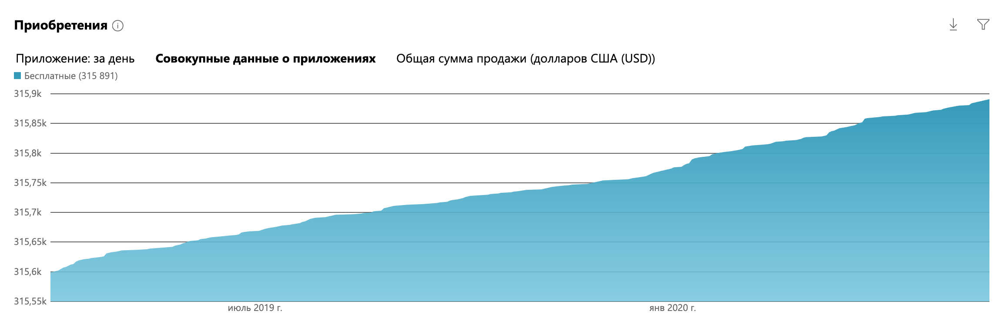

UWP-приложение для отправки поздравлений и сообщений.

## Скриншоты приложения

### Главный интерфейс
Главный экран приложения с вариантами поздравлений.

### Основные возможности
Краткое описание ключевых функций приложения.

### О приложении

Приложение доступно для устройств на Windows, Windows Mobile, Windows Phone и даже XBox. "Мои поздравления" помогает поздравлять друзей и близких. Пользователь может фильтровать поздравления по праздникам, просматривать их в приложении и отправлять по SMS, email или через социальные сети.

[Скачать приложение](https://www.microsoft.com/ru-ru/store/apps/%D0%9C%D0%BE%D0%B8-%D0%BF%D0%BE%D0%B7%D0%B4%D1%80%D0%B0%D0%B2%D0%BB%D0%B5%D0%BD%D0%B8%D1%8F/9wzdncrfhx9x "Скачать приложение")

### Достижения

Лучшее место в Windows Store — 2012 год, когда приложение входило в топ-5 российских приложений Windows Store.

### Популярность

Более 300 000 скачиваний и средняя оценка 4.4 звезды.
